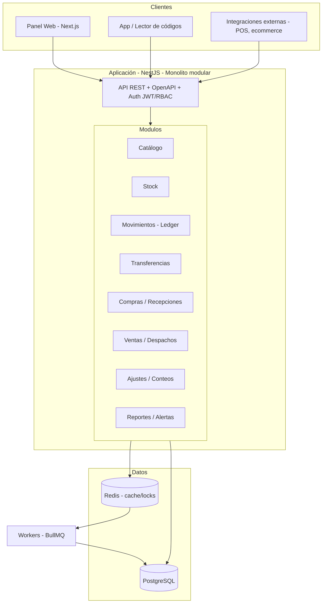
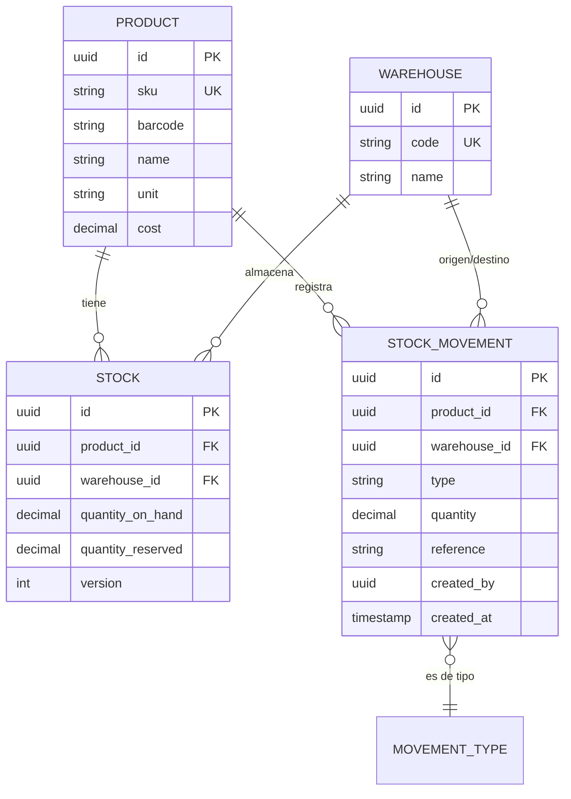

# Sistema de Inventario Multi-Bodega — Especificación de Arquitectura

> Documento de referencia técnica. Pensado para empezar a construir de inmediato.
> Contexto: varias ubicaciones/bodegas · equipo mediano · volumen moderado · stack a definir.

---

## 1. Decisiones clave (resumen ejecutivo)

| Dimensión | Decisión | Por qué |
|---|---|---|
| **Patrón de arquitectura** | **Monolito modular** (NO microservicios) | El volumen moderado no justifica la complejidad operativa de microservicios. El inventario exige **consistencia transaccional** (no se puede vender stock que no existe), y eso es mucho más simple y seguro dentro de un solo proceso/BD. Se estructura en módulos con límites claros para poder partirlo después si crece. |
| **Lenguaje** | **TypeScript** | Un solo lenguaje en front y back, tipado estático (clave para coordinar un equipo mediano), ecosistema enorme. |
| **Backend** | **NestJS** | Framework modular y opinado: cada bounded context es un módulo. Te da estructura desde el día 1 sin sobre-ingeniería. |
| **Base de datos** | **PostgreSQL** | Relacional y **ACID**. El stock necesita transacciones y bloqueos a nivel de fila para no sobre-vender. Postgres lo hace nativo. |
| **Cache / locks / colas** | **Redis** | Cache de disponibilidad, locks de reserva en checkout y backend de jobs. |
| **ORM** | **Prisma** | Tipado end-to-end, migraciones versionadas, excelente DX. |
| **Frontend** | **Next.js (React + TS)** | Mismo lenguaje, SSR opcional, ideal para un panel administrativo interno. |
| **Jobs en background** | **BullMQ** (sobre Redis) | Alertas de stock bajo, expiración de reservas, reabastecimiento, sincronizaciones. |
| **API** | **REST + OpenAPI** | Simple, cacheable y documentado. GraphQL sería sobre-ingeniería ahora. |
| **Despliegue** | **Docker** en host/servicio gestionado · **GitHub Actions** CI/CD | **Sin Kubernetes** todavía: innecesario para este volumen. |

**Alternativa válida al stack:** si priorizas velocidad de desarrollo sobre tipado, **Python + Django** es excelente para inventario (el Django Admin te ahorra meses de CRUD). Trade-off: menos seguridad de tipos y peor cohesión front/back. Mi recomendación firme es **NestJS + TypeScript** por estructura y mantenibilidad a mediano plazo.

---

## 2. Por qué monolito modular y no microservicios

Microservicios resuelven problemas que **todavía no tienes**: equipos grandes trabajando en paralelo, escalado independiente de partes muy dispares, despliegues independientes. A cambio te cobran un precio alto: transacciones distribuidas, consistencia eventual, observabilidad compleja, y mucho DevOps.

En inventario el peor enemigo es la **inconsistencia de stock** (vender lo que no hay, descuadres entre bodegas). Eso se resuelve trivialmente con una transacción de base de datos en un monolito, y se vuelve un dolor de cabeza con microservicios (sagas, compensaciones).

La clave es construir un **monolito modular**: módulos con fronteras explícitas, comunicación entre ellos vía interfaces internas, no acceso directo a las tablas de otro módulo. Así, el día que un módulo realmente necesite escalar o desplegarse aparte, se extrae sin reescribir todo.

**Señales de que llegó el momento de partir algo** (no antes): un módulo concentra >70% de la carga, necesitas escalarlo de forma independiente, o tienes equipos separados que se pisan en los despliegues.

---

## 3. Arquitectura del sistema



---

## 4. Módulos (bounded contexts)

1. **Catálogo** — Productos, SKU, código de barras, atributos, unidades de medida, categorías.
2. **Bodegas / Ubicaciones** — Bodegas, y opcionalmente sub-ubicaciones (pasillo/estante/bin).
3. **Stock** — Existencias actuales por producto y bodega (cantidad disponible, reservada). Estado de lectura rápida.
4. **Movimientos (Ledger)** — Registro **append-only** de toda entrada/salida/ajuste/transferencia. **Fuente de verdad y auditoría.**
5. **Transferencias** — Movimiento de stock entre bodegas (en tránsito → recibido).
6. **Compras / Recepciones** — Órdenes de compra a proveedores y recepción de mercancía (entrada de stock).
7. **Ventas / Despachos** — Salidas de stock, con reservas.
8. **Ajustes / Conteos** — Conteos cíclicos, mermas, correcciones.
9. **Proveedores** — Datos de proveedores y su relación con productos.
10. **Usuarios / Roles / Permisos** — RBAC, con permisos **por bodega**.
11. **Reportes / Alertas** — Dashboards, stock bajo, valorización, rotación, kardex.

---

## 5. Modelo de datos (núcleo)



### Principio crítico: nunca una cantidad mutable "suelta"

El error más común en sistemas de inventario es guardar solo un campo `cantidad` que se suma y resta. Eso destruye la auditoría y genera descuadres imposibles de rastrear.

**Patrón correcto (híbrido, estándar de la industria):**

- `stock_movements` es **append-only** (nunca se actualiza ni borra). Cada entrada, salida, ajuste o transferencia es una fila nueva. Es tu **kardex** y tu auditoría gratis.
- `stock` mantiene el estado actual (`quantity_on_hand`, `quantity_reserved`) para lecturas rápidas.
- **Ambas se actualizan en la misma transacción de base de datos.** El movimiento es la verdad; el `stock` es una caché transaccional consistente.

`disponible = quantity_on_hand - quantity_reserved`

---

## 6. Concurrencia y consistencia (el corazón del sistema)

Aquí es donde un sistema de inventario se gana o se pierde. El escenario a prevenir: dos operaciones descuentan el mismo stock al mismo tiempo y terminas vendiendo de más.

**Estrategia recomendada — bloqueo pesimista por fila:**

```
BEGIN;
  -- bloquea SOLO la fila de ese producto en esa bodega
  SELECT quantity_on_hand, quantity_reserved
    FROM stock
   WHERE product_id = $1 AND warehouse_id = $2
   FOR UPDATE;

  -- validar disponibilidad
  -- si OK: UPDATE stock  +  INSERT stock_movement
COMMIT;
```

`SELECT ... FOR UPDATE` bloquea únicamente la fila afectada, así que no frena el resto del sistema. Para volumen moderado es la opción más simple y 100% correcta.

**Reservas (clave si hay venta/checkout):**

- Al crear un pedido → `quantity_reserved += cantidad` (no toca `on_hand`).
- Al despachar → se convierte en un movimiento de salida: `on_hand -= cantidad` y `reserved -= cantidad`.
- Al cancelar o expirar → `reserved -= cantidad` (libera).
- Un **job de BullMQ** expira reservas abandonadas (ej. carrito sin pagar).

**Idempotencia:** cada operación que muta stock acepta una `idempotency_key`. Si llega dos veces (reintento de red), no se duplica el movimiento.

**Transferencias entre bodegas (2 fases):** salida de bodega origen → estado *en tránsito* → entrada en bodega destino al confirmar recepción. Nunca se "teletransporta" stock en un solo paso.

---

## 7. Optimizaciones

- **Índices**: `(product_id, warehouse_id)` en `stock` y `stock_movements`; índices en `sku` y `barcode`; índice por fecha en movimientos.
- **Cache de disponibilidad** en Redis para lecturas calientes (catálogo, vitrina), invalidada en cada movimiento.
- **Vistas materializadas** para reportes pesados (valorización, rotación, kardex), refrescadas por job — no calcules eso en caliente.
- **Jobs en background (BullMQ)**: alertas de stock bajo, puntos de reorden, expiración de reservas, sincronización con sistemas externos.
- **Réplica de lectura** de Postgres: solo cuando los reportes empiecen a competir con las operaciones. No desde el día 1.
- **Paginación por cursor** en listados grandes (movimientos, productos).

---

## 8. API (diseño)

REST versionado (`/api/v1/...`), documentado con OpenAPI/Swagger autogenerado por NestJS.

Endpoints núcleo (ejemplos):

```
GET    /api/v1/products
POST   /api/v1/products
GET    /api/v1/stock?product=&warehouse=
POST   /api/v1/movements            # entrada/salida/ajuste (idempotente)
POST   /api/v1/transfers            # crear transferencia
POST   /api/v1/transfers/:id/receive
POST   /api/v1/reservations
DELETE /api/v1/reservations/:id
GET    /api/v1/reports/stock-valuation
GET    /api/v1/reports/kardex?product=
```

---

## 9. Seguridad

- **Auth**: JWT (access + refresh).
- **RBAC con alcance por bodega**: un usuario puede ser operador en Bodega A y solo lectura en Bodega B. Roles base: Admin, Supervisor, Operador, Solo-lectura.
- **Auditoría**: ya la tienes gratis — el ledger registra quién (`created_by`) hizo cada movimiento y cuándo.
- Validación de entrada estricta (DTOs + class-validator en NestJS).

---

## 10. Infraestructura y despliegue

- **Docker Compose** para desarrollo (app + Postgres + Redis).
- Producción: un servicio gestionado de contenedores (Railway, Render, Fly.io, o una VM con Docker). **Nada de Kubernetes** a este volumen.
- **CI/CD con GitHub Actions**: lint → tests → migraciones → build → deploy.
- **Migraciones versionadas** con Prisma Migrate (nunca cambios manuales a la BD en producción).
- Backups automáticos diarios de Postgres + logs centralizados.

---

## 11. Roadmap por fases

**Fase 1 — MVP (núcleo correcto)**
Catálogo · Bodegas · Stock + Ledger de movimientos · Entradas/Salidas/Ajustes con bloqueo por fila · Usuarios + RBAC · Panel básico. *Objetivo: que el stock NUNCA descuadre.*

**Fase 2 — Operación multi-bodega**
Transferencias en 2 fases · Compras/Recepciones · Reservas + despachos · Alertas de stock bajo · Reportes (kardex, valorización).

**Fase 3 — Madurez**
Puntos de reorden automáticos · Conteos cíclicos · Integraciones externas (POS/ecommerce) · Dashboards avanzados · Réplica de lectura si hace falta.

---

## 12. Resumen de stack para empezar hoy

```
Backend     → NestJS (TypeScript)
ORM         → Prisma
BD          → PostgreSQL
Cache/Locks → Redis
Jobs        → BullMQ
Frontend    → Next.js (React + TypeScript)
API         → REST + OpenAPI
Auth        → JWT + RBAC por bodega
Infra       → Docker + GitHub Actions (sin Kubernetes)
Patrón      → Monolito modular
```
